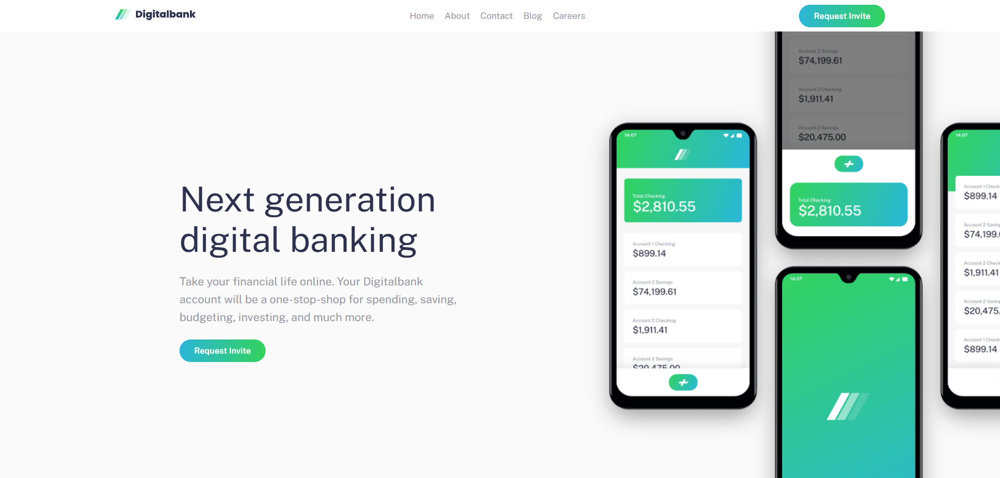

# Frontend Mentor - Digitalbank landing page solution

This is a solution to the [Digitalbank landing page challenge on Frontend Mentor](https://www.frontendmentor.io/challenges/digital-bank-landing-page-WaUhkoDN). Frontend Mentor challenges help improve real-world frontend development skills by building responsive and interactive UI projects.

## Table of contents

- [Overview](#overview)
  - [The challenge](#the-challenge)
  - [Screenshot](#screenshot)
  - [Links](#links)
- [My process](#my-process)
  - [Built with](#built-with)
  - [What I learned](#what-i-learned)
  - [Continued development](#continued-development)
  - [AI Collaboration](#ai-collaboration)
- [Author](#author)

---

# Overview

## The challenge

Users should be able to:

- View the optimal layout for the site depending on their device's screen size
- See hover states for all interactive elements on the page
- Interact with the mobile navigation menu

This project focuses on building a responsive landing page using modern layout techniques like **Flexbox and CSS Grid**, along with implementing **interactive UI behaviors** such as mobile navigation toggling.

---

## Screenshot



---

## Links

- Solution URL:  https://www.frontendmentor.io/solutions/digitalbank-landing-page-mobile-first-3xbnkuyBtU
- Live Site URL:  https://rajesh-medudula.github.io/FM-digitalbank-landing-page/

---

# My process

## Built with

- Semantic HTML5 markup
- CSS custom properties (variables)
- Flexbox
- CSS Grid
- Mobile-first responsive design
- JavaScript (for mobile navigation interaction)

---

## What I learned

Working on this project helped reinforce several important frontend concepts:

- Creating **responsive layouts using CSS Grid and Flexbox**
- Using **`clamp()` and responsive units (`vw`, `rem`)** for scalable typography and element sizing
- Implementing **mobile navigation menus with JavaScript**
- Positioning complex hero images using **absolute positioning and overflow techniques**
- Managing **responsive breakpoints and layout changes using media queries**
- Creating **interactive hover effects using CSS pseudo-elements**

Example of a hover underline effect implemented in the navigation:

```css
.nav-list a::after {
  content: "";
  position: absolute;
  left: 0;
  bottom: -10px;
  width: 0;
  height: 4px;
  background: linear-gradient(
    to right,
    var(--primary-cyan-400),
    var(--primary-green-500)
  );
  transition: width 0.3s ease;
}

.nav-list a:hover::after {
  width: 100%;
}

## Continued development

In future projects, I would like to continue improving in areas such as:

- Perfecting image alignment and positioning to match designs exactly
- Improving responsive layout structure and component organization
- Writing more reusable and scalable CSS
- Implementing accessibility improvements for navigation and interactive elements


## AI Collaboration

During this project, I used **ChatGPT as a development assistant** to help with:

- Debugging layout issues
- Understanding responsive design techniques
- Improving CSS structure and organization
- Exploring best practices for positioning and layout

Using AI as a coding assistant helped speed up problem-solving and provided alternative approaches for implementing certain UI behaviors.


## Author

- Frontend Mentor - Rajesh Medudula
- LinkedIn - [Rajesh Medudula](https://www.linkedin.com/in/rajeshmedudula/)